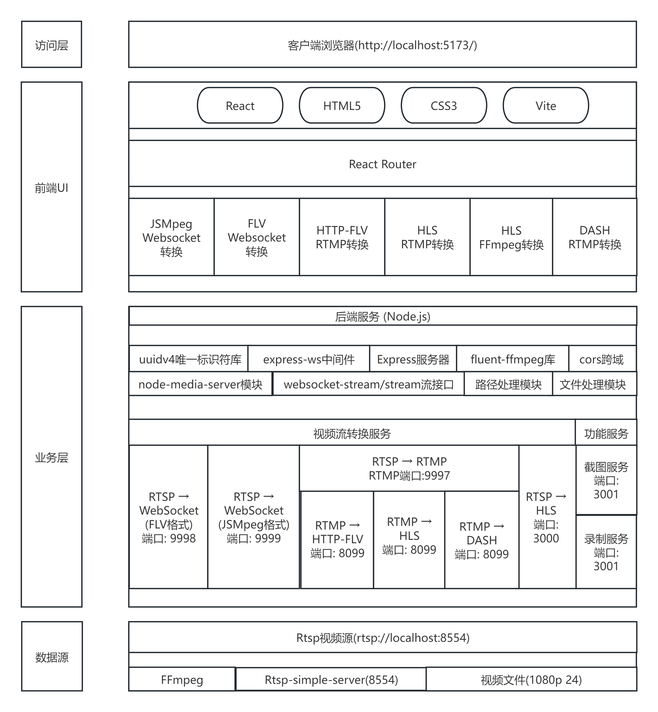
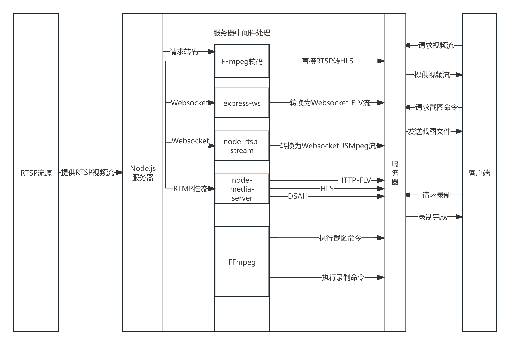

# RTSP流媒体Web播放器的设计与实现
一个基于 Node.js 和 React 的综合性 RTSP 视频流处理与播放平台，支持多种视频流协议和播放方式，提供完整的视频流转换、播放、截图和录制功能。
## Rtsp协议介绍
>RTSP(Real-Time Stream Protocol)协议是一个基于文本的多媒体播放控制协议，属于应用层。RTSP以客户端方式工作，对流媒体提供播放、暂停、后退、前进等操作。该标准由IETF指定，对应的协议是RFC2326。RTSP作为一个应用层协议，提供了一个可供扩展的框架，使得流媒体的受控和点播变得可能，它主要用来控制具有实时特性的数据的发送，但其本身并不用于传送流媒体数据，而必须依赖下层传输协议(如RTP/RTCP)所提供的服务来完成流媒体数据的传送。RTSP负责定义具体的控制信息、操作方法、状态码，以及描述与RTP之间的交互操作。
## 系统架构图



## 数据流程图



## 功能特性
* 把Rtsp视频流实时转换为Web可以播放的格式
* 支持多播放器选择，如flv.js、hls.js、JSMpeg
* 支持监控面板一屏多看
* 增加了截图与录制功能

## 技术栈
### 前端
* React
* React Router
* flv.js
* hls.js
* JSMpeg
* vite
### 后端
* Node.js
* Express
* Express-ws
* FFmpeg
* node-media-server
* node-rtsp-stream
* websocket-stream

## 环境依赖
1. 安装Rtsp-simple-server,并把RtspAddress 端口改为 8554，终端运行`Rtsp-simple-server`命令
2. 安装ffmpeg，并且添加环境变量
3. 执行指令 `ffmpeg -re -stream_loop -1 -i "D:\software\ffmpeg-7.0.2-full_build\bin\视频文件.mp4" -vcodec libx264 -acodec aac -f rtsp rtsp://localhost:8554/mystream`可以将其中的视频参数和rtsp流参数进行更改
4. 执行指令
    ```bash
    cd ./client
    npm install
    ```
    ```bash
    cd ./server
    npm install
    ```
    ```bash
    npm install
    npm run dev
    ```
## 配置说明

```javascript
const FFMPEG_PATH = "路径/到/ffmpeg"; // 修改为你的 FFmpeg 可执行文件路径
```

```javascript
const rtspUrl = 'rtsp://localhost:8554/mystream'; // 修改为你的 RTSP 流地址
```
## 端口使用说明
* 9997:RTMP 服务器
* 9998:RTSP 转 WebSocket (FLV)
* 9999:RTSP 转 WebSocket (JSMpeg)
* 8099: NodeMediaServer HTTP 服务 (HLS 和 HTTP-FLV)
* 3000: M3U8 服务
* 3001: 截图和录制服务
* 5173: 前端开发服务器 (Vite)
**确保这些端口没有被其他应用占用。**

## 使用指南
### 主页导航
* JSMpeg 播放器：低延迟播放，适合实时监控
* Flv.js 播放器 1：通过 WebSocket 播放 FLV 流
* Flv.js 播放器 2：通过 HTTP 播放 FLV 流
* HLS 播放器 1：通过 NodeMediaServer 播放 HLS 流
* HLS 播放器 2：通过直接转换的 HLS 流播放
* 监控视频面板：在单一界面查看所有流
### 截图功能
* 在各播放器页面中，点击"截取快照"按钮可获取当前画面的 JPEG 图像。系统会自动下载截图文件。
### 录制功能
* 在支持的播放器页面中，点击"保存 RTSP 流到本地"按钮可录制 10 秒的视频流片段。文件将保存到服务器的 `rtspSave`目录中。

## 目录结构
    /
    ├── client/
    │   ├── src/
    |   |   |—— components/         # React 组件
    |   |   |     |—— FlvPlayer1.jsx
    |   |   |     |—— FlvPlayer2.jsx
    |   |   |     |—— HlsPlayer1.jsx
    |   |   |     |—— HlsPlayer2.jsx
    |   |   |     |—— index.css     # 组件样式表
    |   |   |     |—— JsmpegPlayer.jsx
    |   |   │     └── MonitoringPanel.jsx
    |   |   |—— other/              # 保存暂时不用的代码
    |   │   |── public/             # 暂时无用
    |   │   |── index.css           # 全局的css样式
    |   │   └── main.jsx            # React 应用入口
    │   ├── index.html              # 前端入口 HTML
    │   ├── package-lock.json
    │   |── package.json            # 前端打包
    │   └── vite.config.js          # vite配置
    |
    ├── server/
    │   ├── hls/                    # HLS 分片存储目录
    │   ├── media/
    |   │   └── live/
    |   │       └── mystream/       # NodeMediaServer 媒体文件存储
    │   ├── public/                 # 暂时无用
    │   ├── rtspsave/               # 录制的视频存储目录
    │   ├── main.js                 # 主服务器文件
    │   ├── package-lock.json
    │   └── package.json            # 后端打包
    ├── .gitignore
    ├── package-lock.json
    ├── package.json                # 总的打包
    └── readme.md

## 联系方式
* 邮箱：rtsp-web@example.com
* GitHub：https://github.com/yourusername/rtsp-web
